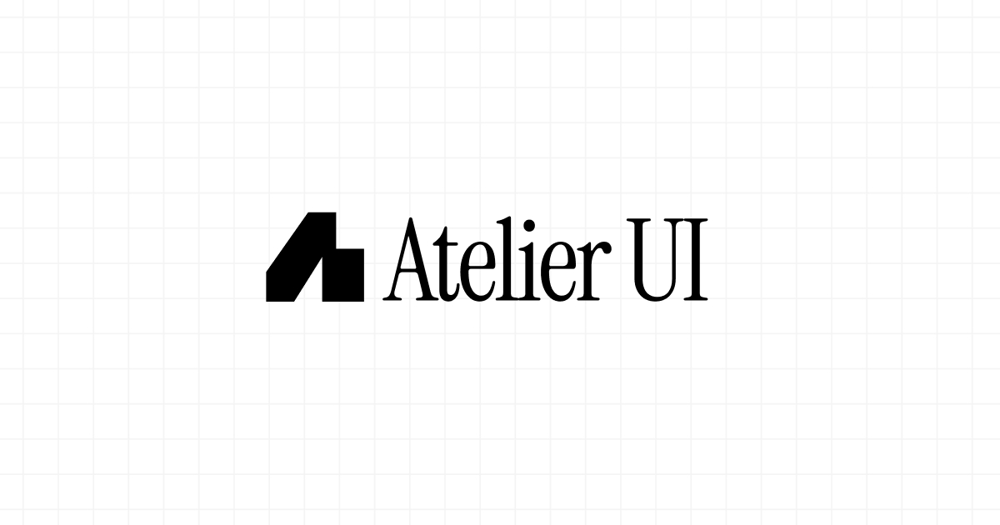

# Atelier UI

[](https://www.npmjs.com/package/atelier-ui)
[](https://github.com/whatisjery/atelier-ui/stargazers)
[](https://github.com/whatisjery/atelier-ui/blob/main/LICENSE.md)

<a href="https://atelier-ui.com">
  <picture>
    <source media="(prefers-color-scheme: dark)" srcset="./public/images/og_img_dark.jpg" />
    <source media="(prefers-color-scheme: light)" srcset="./public/images/og_img_light.jpg" />
    
  </picture>
</a>


## 🎨 What is Atelier UI?

Atelier (French for workshop) is a growing library of fully customizable React animated components
and tooling that help developers create interactive user experiences with ease.

## ✨ Features

- **It's your code.** Components are copied into your project and remain fully customizable.
- **Ready-made effects.** Text animations, cursor interactions, scroll effects, transitions, and more.
- **A real WebGL system.** Components share a single canvas and stay aligned to
  the DOM.
- **Built for React 19 + Tailwind v4.** Works with Next.js, Vite, or any React
  setup.

## 📦 Install

Add any component by name:

```bash
npx atelier-ui add fluid-distortion
```

This copies the source into your project, pulls in anything shared, and installs
the dependencies it needs.

## ⚙️ How it works

Most components are a single file you copy and edit.

WebGL components share one canvas. A provider wraps the app root once, and each
component renders as a normal element while staying aligned to the DOM as the
page scrolls and resizes.

- **WebGL Image, Video, and Text** mirror a real DOM element onto a tracked
  plane, so the page stays accessible.
- **WebGL Scene** has its own camera and renders into a tracked area, for
  effects that need camera motion.

## 📖 Docs

Browse every component with live previews at
[atelier-ui.com/docs](https://atelier-ui.com/docs).

## 🤝 Contributing

See the [contribution guide](https://atelier-ui.com/docs/getting-started/contribution).

## 📄 License

[MIT](LICENSE.md).
