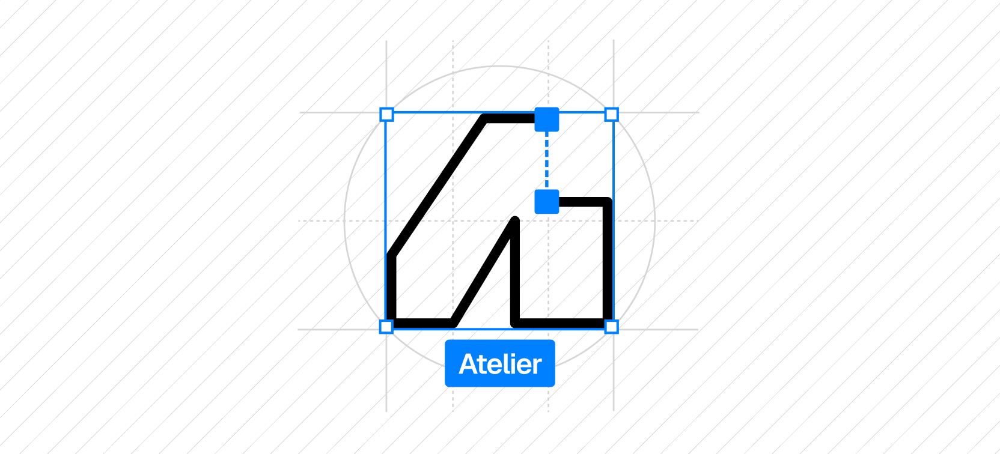

# Atelier UI

<a href="https://atelier-ui.com">
  <picture>
    <source media="(prefers-color-scheme: dark)" srcset="./public/images/logo-variant-dark.png" />
    <source media="(prefers-color-scheme: light)" srcset="./public/images/logo-variant-light.png" />
    
  </picture>
</a>

## About Atelier UI

Atelier means **workshop** in French.

I built Atelier UI because I wanted a place to publish the effects and animations I might work on in the future, and share them with other developers, instead of throwing them away. Components are built with React and are yours to copy, paste and use however you want.

The whole project is open source — feel free to [contribute](https://atelier-ui.com/docs/getting-started/contribution) if you want to get involved!

---

## Documentation

Visit [https://atelier-ui.com/docs](https://atelier-ui.com/docs) to view the documentation.

## License

Licensed under the [MIT License](LICENSE.md).