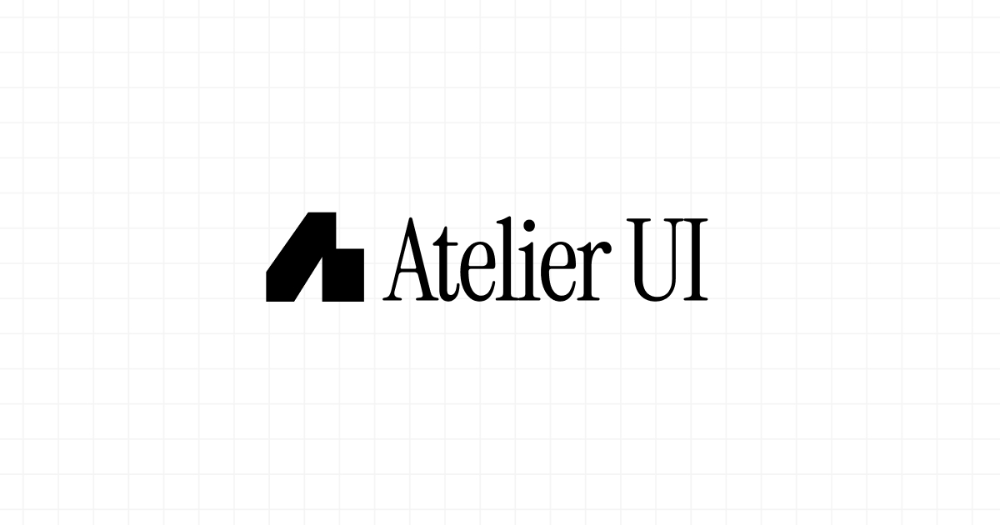

# Atelier UI

[](https://www.npmjs.com/package/atelier-ui)
[](https://github.com/whatisjery/atelier-ui/stargazers)
[](https://github.com/whatisjery/atelier-ui/blob/main/LICENSE.md)

<a href="https://atelier-ui.com">
  <picture>
    <source media="(prefers-color-scheme: dark)" srcset="./public/images/og_img_dark.jpg" />
    <source media="(prefers-color-scheme: light)" srcset="./public/images/og_img_light.jpg" />
    
  </picture>
</a>


## 🎨 What is Atelier UI?

Atelier (French for workshop) is a Motion and React Three Fiber component system,
built for React and Next.js. You copy the source into your project and own it.

## ✨ Features

- **It's your code.** Components are copied into your project and remain fully customizable.
- **Ready-made effects.** Backgrounds, text animations, cursor interactions, scroll effects, and page transitions.
- **A real WebGL system.** Components share a single canvas and stay aligned to
  the DOM.
- **Built for React 19 + Tailwind v4.** Works with Next.js, Vite, or any React
  setup. Page transitions are the exception and need Next.js 15.3 or later.

## 📦 Install

Add any component by name:

```bash
npx shadcn@latest add @atelier/fluid-distortion
```

This copies the source into your project, pulls in anything shared, and installs
the dependencies it needs.

Most components are free and MIT. Some need a [license key](https://www.atelier-ui.com/docs/getting-started/license),
set as `ATELIER_PRO_KEY` in `.env.local`, and install with the same command.

## ⚙️ How it works

Every component plugs into three shared systems, mounted once in your root layout.

- **One WebGL provider.** Every WebGL component renders into a single `<Canvas>`.
  Textures, shaders and post-processing are shared, so adding an effect doesn't
  add a context.
- **One Smooth Scroll provider.** Lenis runs on the same Motion loop that renders
  the canvas, so WebGL effects stay aligned to the DOM at any scroll speed.
- **One transition system.** `TransitionPage` wraps the route content,
  `TransitionLink` triggers the change.

Every install also writes a skill file that tells your coding agent how to wire
what it just copied.

## 📖 Docs

Browse every component with live previews at
[atelier-ui.com/docs](https://atelier-ui.com/docs).

## 🤝 Contributing

See the [contribution guide](https://atelier-ui.com/docs/getting-started/contribution).

## 📄 License

[MIT](LICENSE.md).
